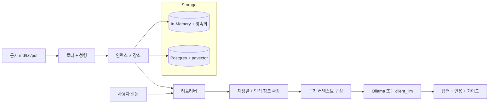

# 포트폴리오 요약: 로컬 LLM 문서 RAG

## 1. 문제와 목표

이 프로젝트는 사내 문서를 대상으로 한 로컬 RAG 서비스입니다.  
단순 검색을 넘어서 인덱싱, 검색, 근거 기반 답변 생성, 인용(citation), 스트리밍 응답까지 포함한 실제 서비스 형태로 구현했습니다.

## 2. 아키텍처



## 3. 포트폴리오 강점

- 노트북 실험이 아닌 End-to-End RAG 서버
- MCP + REST + Web UI + SSE 스트리밍 구성
- 하이브리드 검색(BM25 + 벡터 + 재정렬 + 다양성 패널티)
- 테이블/메뉴/스키마 질의를 위한 결정적 구조 추출 경로
- 테스트, 평가, 벤치마크 스크립트 포함

## 4. 측정 지표 (2026-02-20)

### 품질 평가 (`npm run eval`)

- 질문 수: `5`
- top_citation_hit_rate: `1.00`
- top3_citation_hit_rate: `1.00`
- keyword_hit_rate: `0.60`
- 평균 지연: `3ms`

### API 지연 (`BENCH_QUESTION="..." npm run bench`, 로컬 HTTP, 5회)

- `/api/ask`: 평균 `5.4ms`, p95 `15.9ms`
- `/api/ask-stream`: 평균 `3.5ms`, p95 `4.2ms`, 평균 TTFT `3.5ms`

### 타깃 개선 결과 (테이블 목록 질의)

- 개선 전(UI 스트림 경로): 테이블 항목 `5/8` 반환
- 개선 후(현재 스트림 경로 + 구조 추출): `8/8` 반환
- 포함 항목: `REPORT`, `KEYPOINT`, `공통`

## 5. 핵심 개선 사항

1. 스트림 경로 정확도 개선  
- `/api/ask-stream`에서 구조 질의를 우선 결정적 추출 경로로 라우팅

2. 근거 컨텍스트 확장  
- 고정 짧은 스니펫 대신 질문 의도 기반 컨텍스트 예산 방식 적용

3. 인덱싱 속도 개선  
- Ollama 임베딩 호출을 순차 방식에서 제한 동시성 방식으로 변경

4. 검색 성능 개선  
- BM25 문서 통계/토큰 상태 캐시 도입으로 질의 시 재계산 최소화

5. 회귀 방지  
- `/api/ask-stream` 구조 질의 품질 통합 테스트 추가


## 6. 재현 커맨드

```bash
npm run test
npm run eval
BENCH_QUESTION="테이블 목록 알려줘" npm run bench
```

3분 데모 순서는 `docs/portfolio/demo-script.md` 참고.
